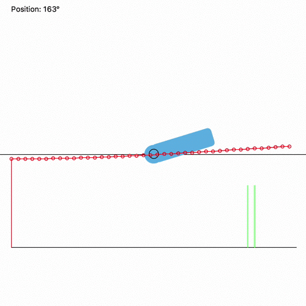

# SmoothServo
The idea was to build an arduino library for smooth servo motion control. **Currently only the proof of concept in processing has been implemented.**

## Idea
The idea behind SmoothServo is, to create a library which controls the motion of a servo. Every motion should be start and and with an easing to avoid inertial force.

Every command to the servo is queued as task in a task list and needs a time to run and an easing curve.

The task then is split up into three different tasks:

* start (with easing)
* motion (linear)
* end (with easing)

If now a new task is coming into the queue, but the servo is still moving, the motion task will bit canceled and the servo will run the end task. So there is never a fast stop of the servo.

*SmoothServo simulation.*

## Interface

There are advanced commands:

* moveTo(int position, int time)
* stop()
* stop(int time)

And more specific which are used by the library:

* addTask(Task task)
* cancelCurrentTask()
* cancelAllTasks()
* update()

A task object has following attributes:

* Type (Start, Motion, End)
* Target : Int
* Time : Int
* State : Enum (Waiting, Running, Finished, Canceled)
